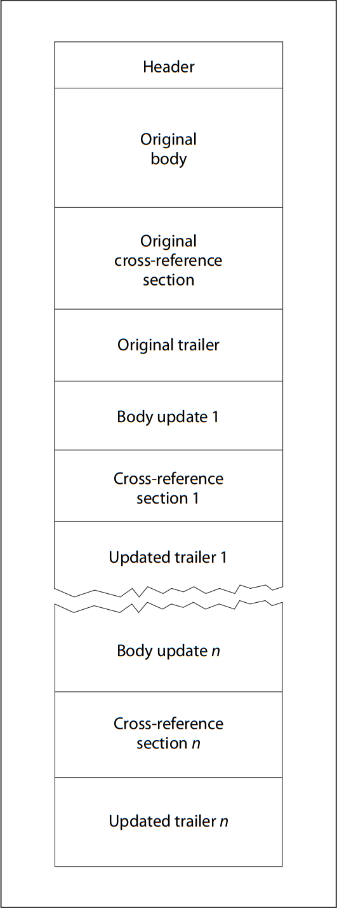

## 文件头 head

PDF 文件的第一行应是一个标题，由 5 个字符 %PDF–后跟 1.N 形式的版本号组成，其中 N 是 0 到 7 之间的数字。
符合标准的阅读器(解析器)应接受具有以下任何标头的文件：

```
%PDF–1.0

%PDF–1.1

%PDF–1.2

%PDF–1.3

%PDF–1.4

%PDF–1.5

%PDF–1.6

%PDF–1.7
```

从 PDF 1.4 开始，应使用文档目录词典中的版本条目代替页眉中指定的版本。

## 主体 body

PDF 文件的正文应由一系列表示文档内容的间接对象组成

## 交叉引用表 Cross-Reference Table

交叉引用表包含允许随机访问文件中间接对象的信息，以便无需读取整个文件即可找到任何特定对象。该表应包含每个间接对象的一行条目，指定该对象在文件正文中的字节偏移量。（从 PDF 1.5 开始，部分或全部交叉引用信息可以包含在**交叉引用流**中;

    注 1：交叉引用表是 PDF 文件中唯一具有固定格式的部分，它允许随机访问表中的条目。

该表包含一个或多个交叉引用部分。最初，整个表格由一个部分组成（如果文件是线性化的，则由两个部分组成;见附件 F）。每次增量更新文件时，应添加一个附加部分（请参见 7.5.6 “增量更新”）。

每个交叉引用部分应以包含关键字外部参照的行开头。这一行后面应是一个或多个交叉引用小节，可以按任何顺序出现。对于从未增量更新的文件，交叉引用节应仅包含一个小节，其对象编号从 0 开始。

    注 2 小节结构对于增量更新很有用，因为它允许将新的交叉引用节添加到 PDF 文件中，仅包含已添加或删除对象的条目。

每个交叉引用小节应包含连续范围的物体编号的条目。该小节应以包含两个数字的行开头，用空格（20h）分隔，表示本小节中第一个对象的对象编号和小节中的条目数。

此行后面是交叉引用条目本身，每行一个。每个条目的长度应正好为 20 个字节，包括行尾标记。有两种类型的交叉引用条目：一种用于正在使用的对象，另一种用于已删除并因此是空闲的对象。两种类型的条目都有类似的基本格式，由关键字 n（用于使用中的条目）或 f（用于空闲条目）区分。使用中条目的格式应为：

    nnnnnnnnnnnn ggggg n eol

    其中————
    nnnnnn 应为解码流中的 10 位字节偏移量

    GGGGG 应为 5 位代号

    n 应是一个关键字，将其标识为正在使用的条目

    EOL 应为 2 个字符的行尾序列

条目可以通过两种方式成为空闲条目列表的成员。

使用基本机制，交叉引用表中的空闲条目可以形成一个链表，每个空闲条目都包含下一个目标编号。表中的第一个条目（对象编号 0）应始终是空闲的，并且应具有 65，535 的代号;它应该是空闲对象链表的头部。最后一个空闲条目（链表的尾部）链接回对象编号 0。

使用第二种机制，该表可能包含其他空闲条目，这些条目链接回对象编号 0，并且生成编号为 65，535，即使这些条目本身不在链表中。

除对象编号 0 外，交叉引用表中的所有对象最初应具有 0 的代号。删除间接对象时，应将其交叉引用条目标记为空闲，并应将其添加到空闲条目的链接列表中。条目的世代号应递增 1，以指示下次创建具有该对象编号的对象时要使用的世代号。因此，每次重复使用该条目时，都会为其提供新的代号。最大世代数为 65，535;当交叉引用条目达到此值时，不得重复使用。

交叉引用表（包括原始交叉引用部分和所有更新部分）应包含从 0 到文件中定义的最大对象编号的每个对象编号的一个条目，即使此范围内的一个或多个对象编号实际上并未出现在文件中。
## Trailer
Key|Type|Value
-|-|-
`Size`|`integer`|（必填;不得间接参考）文件的交叉引用表中的条目总数，由原始节和所有更新节的组合定义。等效地，此值应比文件中定义的最高对象编号大 1。交叉引用节中编号大于此值的任何对象都应被忽略，并由符合要求的读者定义为缺失。
`Prev`|`integer`|（仅当文件有多个交叉引用部分时才存在;应为间接引用）解码流中从文件开头到上一个交叉引用部分开头的字节偏移量。
`Root`|`dictionary`|（必填;应为间接参考）文件中包含的 PDF 文档的目录字典（请参见 7.7.2 “文档目录”）。
`Encrypt`|`dictionary`|（如果文档已加密，则为必填项;PDF 1.1）文档的加密词典（见7.6，“加密”）。
`Info`|`dictionary`|（可选;应为间接参考）文档的信息字典（请参见 14.3.3 “文档信息字典”）。
`ID`|`array`|（如果存在加密条目，则为必需;否则可选;PDF 1.1）一个由两个字节字符串组成的数组，构成文件的文件标识符（参见14.4，“文件标识符”）。如果存在加密条目，则此数组和两个字节字符串应为直接对象，并且应未加密。注 1：由于 ID 条目未加密，因此可以检查 ID 密钥以确保在不解密文件的情况下访问正确的文件。字符串是直接对象且未加密的限制确保了这是可能的。注 2：尽管此条目是可选的，但缺少此条目可能会阻止文件在某些依赖于唯一标识文件的工作流中运行。注 3 ID 字符串的值用作加密算法的输入。如果这些字符串是间接的，或者 ID 数组是间接的，则这些字符串在写入时将被加密。这将导致读取器的循环条件：必须解密 ID 字符串才能使用它们解密字符串，包括 ID 字符串本身。上述限制可防止此循环情况。

## 流对象

Key|Type|Value
-|-|-
Length|integer|（必填）从关键字流后面的行首到关键字结束流之前的最后一个字节的字节数。（可能还有一个额外的 EOL 标记，即结束流之前，该标记未包含在计数中，并且在逻辑上不是流数据的一部分。有关进一步讨论，请参见 7.3.8.2 “流范围”。
过滤器|名称或数组|（可选）在处理关键字流和结束流之间找到的流数据或零个、一个或多个名称的数组时应应用的过滤器的名称。应按应用顺序指定多个过滤器。
DecodeParms|dictionary or array|（可选）参数字典或此类字典的数组，由 Filter 指定的筛选器使用。如果只有一个过滤器并且该过滤器具有参数，则应将解码参数设置为过滤器的参数字典，除非过滤器的所有参数都有其默认值，在这种情况下，可以省略解码Parms 条目。如果有多个过滤器，并且任何过滤器的参数设置为非默认值，则 DecodeParms 应是一个数组，每个过滤器都有一个条目：该过滤器的参数字典，或者如果该过滤器没有参数（或者如果其所有参数都有其默认值），则为 null 对象。如果所有筛选器都没有参数，或者其所有参数都具有默认值，则可以省略 DecodeParms 条目。
F|file specification|（可选;PDF 1.2） 包含流数据的文件。如果存在此条目，则应忽略流和结束流之间的字节。但是，Length 条目仍应指定这些字节的数量（通常，没有字节，长度为 0）。应用于文件数据的过滤器应由 FFilter 指定，过滤器参数应由 FDecodeParms 指定。
FFilter|name or array|（可选;PDF 1.2） 用于处理在流的外部文件或零个、一个或多个此类名称的数组中找到的数据时应用的过滤器的名称。规则与筛选器相同。
FDecodeParms|dictionary or array|（可选;PDF 1.2） 由 FFilter 指定的过滤器使用的参数字典或此类字典的数组。与DecodeParms相同的规则适用。
DL|integer|（可选;PDF 1.5） 一个非负整数，表示解码（去过滤）流中的字节数。例如，它可用于确定是否有足够的磁盘空间将流写入文件。此值应仅被视为提示;对于某些流筛选器，可能无法精确确定此值。


## 对象流

key|type|description
-|-|-
Type|name|（必填）此字典描述的 PDF 对象的类型;对于对象流，应为“ObjStm”。
N|integer|（必填）流中存储的间接对象数。
First|integer|（必填）第一个压缩对象的解码流中的字节偏移量。
Extends|stream|（可选）对另一个对象流的引用，其中当前对象流应被视为扩展。这两个流都被视为对象流集合的一部分（见下文）。给定集合由一组流组成，这些流的扩展链接形成有向无环图。

## 增量更新 Incremental Updates
